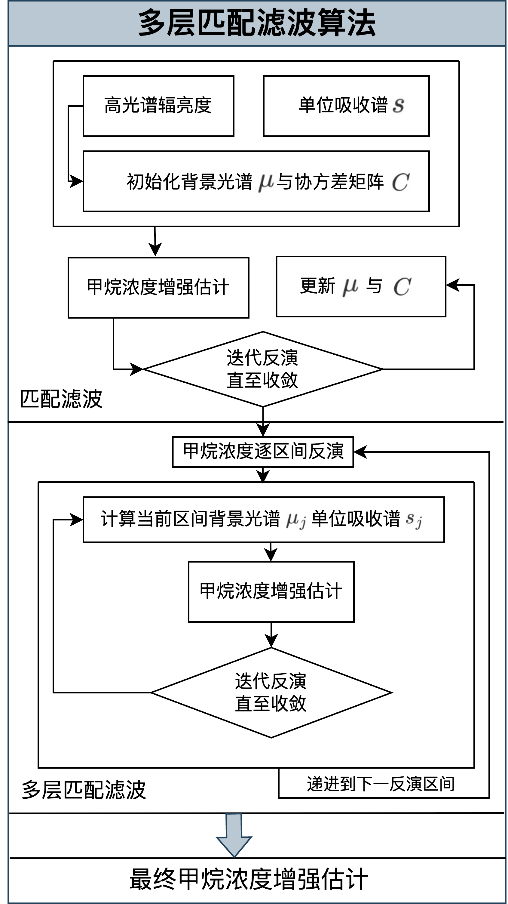
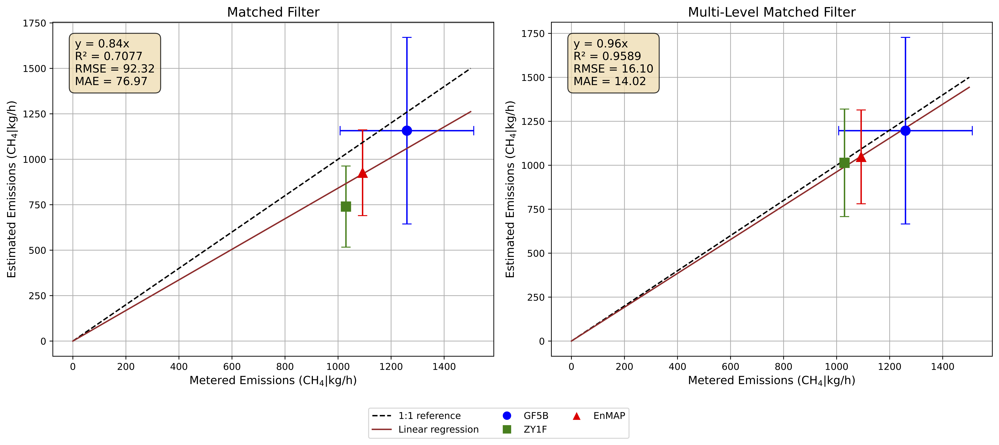

# 多层匹配滤波算法

## 甲烷点源监测

在全球气候变化的大背景下，甲烷作为一种强效温室气体，其准确监测和量化对于气候变化减缓至关重要。甲烷在大气中的寿命约为12年，同时具有很强的增温潜势，这一特性使得减少甲烷排放能够在短期内产生显著的气候改善效果。目前，人类活动（特别是化石燃料行业）贡献了全球人为甲烷排放的约35%，其中点源排放对总体排放贡献很大，监测和改进措施相对容易开展。

卫星遥感，特别是高光谱成像仪，具备精细的光谱分辨率和空间分辨率，能够将实现甲烷排放设施的定位和排放估算。

## 多层匹配滤波算法

大气遥感研究团队最近开发出了一种创新性的多层匹配滤波算法（Multi-Level Matched Filter，MLMF），在甲烷排放监测领域取得了重大突破。

我们开发的MLMF算法主要创新点包括：

* 采用分段回归方法，显著提高了高浓度甲烷羽流的检测精度
* 引入辐亮度查找表进行单位吸收光谱匹配
* 优化了背景和羽流像素的区分方法

我们开发的MLMF算法验证效果显著，通过多项严格测试，MLMF算法展现出显著优势：

* 高浓度区域的相对误差从 -30 %降低到 ±5 %以内
* 模拟数据测试中，均方根误差（RMSE）从 1563.63 ppm·m降低到 337.09 ppm·m
* 在控制释放实验中，排放率估算的 R² 从 0.71 提升至 0.96，RMSE 从 92.32 kg/h 降低到 16.10 kg/h。

下图分别是使用匹配滤波算法和多层匹配滤波算法对控制释放实验中过境卫星影像反演的结果，其中左侧为匹配滤波算法结果，右侧为多层匹配滤波算法结果，自上而下分别对应 EnMAP、ZY1F 和 GF5B 卫星传感器。

基于综合质量增强法和控制释放实验中实测的地表风速，我们对监测到的排放活动进行了烟羽提取和排放量化，下图是多层匹配滤波算法与传统匹配滤波之间的排放速率估算对比图。

## 应用前景

该算法不仅提高了甲烷检测和排放量化的准确性，还可以与其他技术兼容，具有集成到甲烷点源实时监测系统的潜力。
